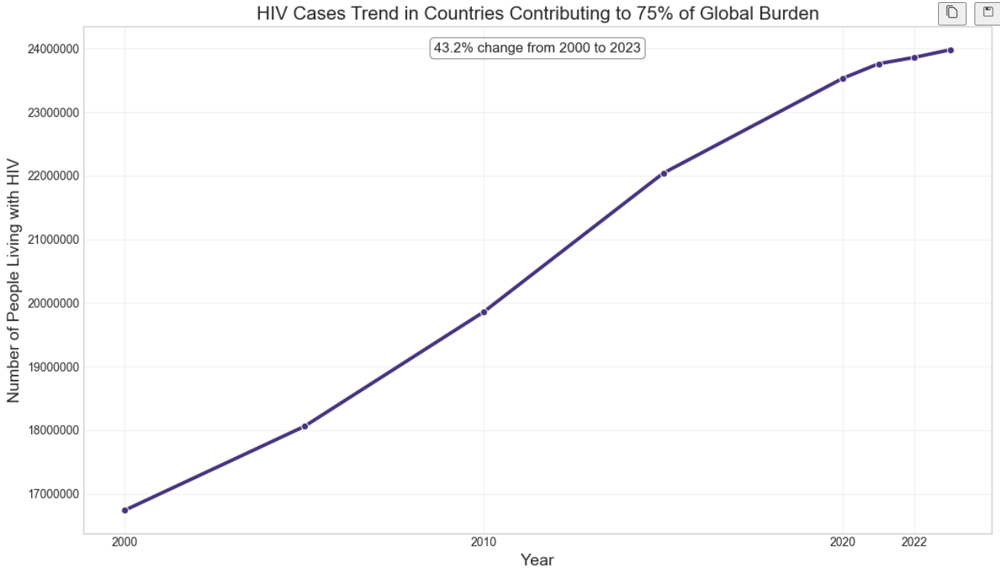
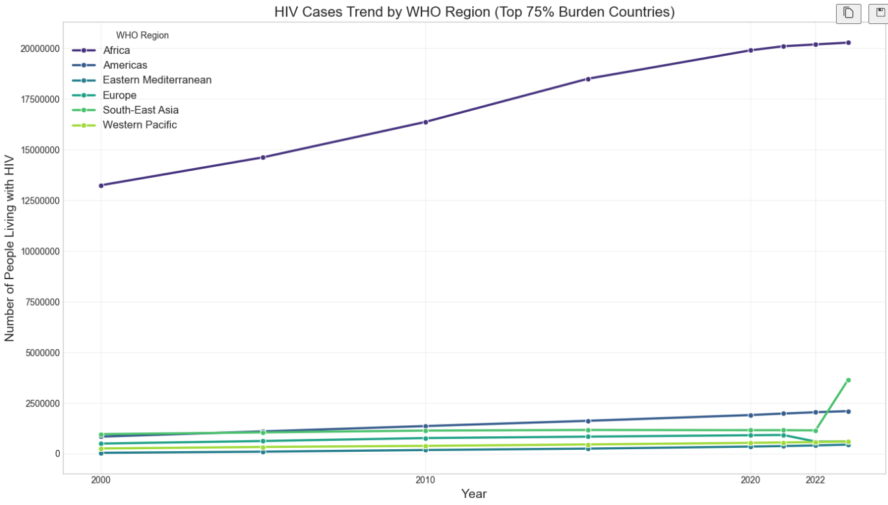

# Introduction

Write your introduction here.

# Data Analysis

# Question 1

Based on the analysis of the merged HIV and multidimensional poverty data, a consistent positive relationship was observed: countries and years with higher levels of multidimensional poverty indicators tend to be associated with a greater number of people living with HIV. Several individual factors contributing to multidimensional poverty, including monetary poverty, MPI headcount, access to drinking water, electricity, and sanitation, as well as educational attainment, showed statistically significant positive associations with HIV cases based on correlation and simple regression analysis of the merged dataset covering specific country-year observations. Conversely, educational enrollment did not exhibit a significant relationship in this analysis. While the sample size of the merged data is limited, the findings suggest that addressing various dimensions of poverty could be relevant in strategies aimed at reducing the HIV burden.

# Question 2

Highest Under-Five Mortality Rate: South Sudan (SSD) with 135.3 deaths/1000 live births (Year 2006)
Highest Neonatal Mortality Rate: South Sudan (SSD) with 52.0 deaths/1000 live births (Year 2006)